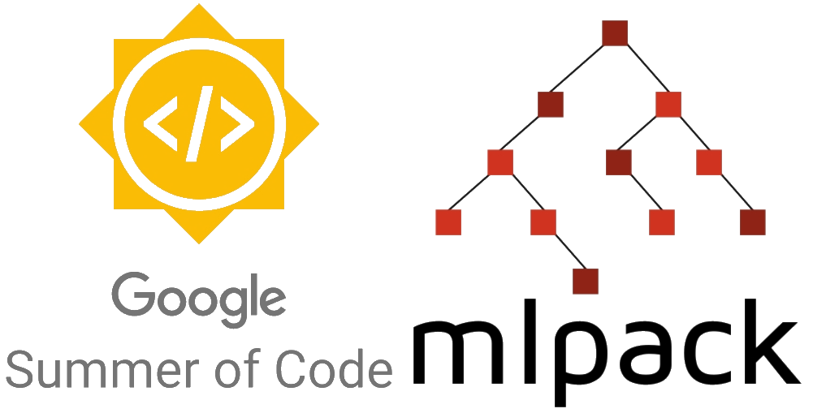
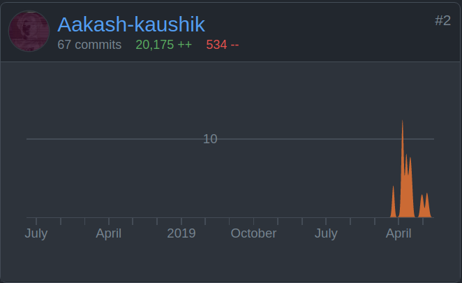

**Organisation: [mlpack](https://github.com/mlpack)**

**Project: Addition of ResNet Module and MobileNet V1**

**Mentors: [Marcus Edel](https://github.com/zoq) and [Kartik dutt](https://github.com/kartikdutt18)**

## Abstract

I was selected for google summer of code 2021 to work with mlpack on the project `Ready to use models in mlpack`, mlpack is an intuitive, fast and flexible C++ machine learning library with bindings to other languages. In the recent years computer vision has taken many turns and at this point it is at a mature stage that when you need to use say a classification model you don't need to construct the complete architecture on your own you can just write a single line of code and it created the a complete pretrained model for you which is what i did and added ResNet module and MobileNetV1 with pretrained weights on imagenet. 

## Goal

The goal of this proposal was to implement `MobileNetV1` which will also include implementing `depthwise separable convolutions` and a `ResNet` model builder that can be used to create `resnet18`, `resnet34`, `resnet50`, `resnet101`, and `resnet152`. This project would fall under the idea: `Ready to use models in mlpack`, the resnet builder and MobileNetV1 will fall under the [models](https://github.com/mlpack/models) repository and depthwise separable convolutions will fall under the mlpack repository as a layer inside the artificial neural network codebase.

## Results

Both the model builders that i proposed with pretrained weights with a lot of configuration are now available in the mlpack codebase. On the way we faced and discorvered small issues or implementation bugs which we corrected but we still face some issues with the tests of depthwise separable convolutions and so that PR is still not merged so at this point if you only wanted an overview of what i did this summer this should do but if you are really interested which i hope you are let's go ahead and take a look at everything i did but before that I would like to thank Kartik because yes the format i choose for writing this is originally his and yes this is 100% inspired by his with a little tweaks of mine. 

## Contributions with --verbose=3

## mlpack/models Contributions

## 1. 

